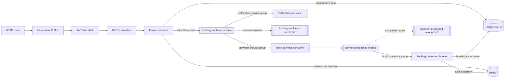

# EventHub — Ticket Booking & Order Processing

[](https://github.com/ahdyahmed/eventhub-booking-system/actions/workflows/ci.yml)

EventHub is a production-minded Spring Boot portfolio system for public event discovery and concurrency-safe ticket booking. It demonstrates the failure cases that make booking systems interesting: simultaneous seat races, cache consistency, asynchronous payment state, consumer retries, ownership enforcement, and traceability across HTTP and Kafka.

**Release:** v1.0 · Java 21 · Spring Boot 3.3.4 · PostgreSQL · Redis · Kafka · Docker

## Why this project stands out

| Problem | Implementation | Proof |
|---------|----------------|-------|
| Two users race for one seat | JPA `@Version` optimistic locking with transaction-level conflict translation | Real concurrent HTTP integration test and load harness: exactly one `201`, all other contenders receive `409` |
| Hot catalog and availability reads | Redis cache-aside with per-cache TTLs, targeted eviction, graceful cache-error handling, and metrics | Testcontainers cache hit/miss/invalidation tests plus measured hits under real-stack load |
| Booking work should not block on payment/email | Kafka fan-out by consumer group; payment result drives the booking state machine | End-to-end Testcontainers event-chain test including retry and dead-letter behavior |
| A user must not access another user's booking | Stateless JWT identity and service-layer ownership checks | Authentication, filter, and ownership test coverage with consistent `401`/`403` errors |
| One request crosses HTTP and async boundaries | Validated correlation ID in MDC and Kafka record headers; JSON lifecycle logs | Filter/interceptor tests and end-to-end smoke verification |

## Architecture



The application is a feature-oriented modular monolith. PostgreSQL is authoritative; Redis only accelerates reads. Booking creation reserves all requested seats in one transaction or fails without a partial booking. Kafka processing starts after that database transaction commits, then independent payment and notification groups receive the event.

The editable diagrams.net source contains four detailed pages—request flow, event flow, cache layer, and Docker network: [`docs/architecture.drawio`](docs/architecture.drawio).

## Quick start

Prerequisites: Docker Desktop with Compose and PowerShell 7+.

```powershell
Copy-Item .env.example .env   # optional; defaults already work
docker compose up -d --build
./scripts/seed-demo.ps1
Start-Process http://localhost:8080/swagger-ui.html
```

The seed is opt-in and idempotent. It creates two venues, three future-dated events, and 24 seats, then clears only EventHub catalog cache keys. It does not create credentials; register your own demo user in Swagger.

Verify the stack:

```powershell
docker compose ps
Invoke-RestMethod http://localhost:8080/actuator/health/liveness
./scripts/smoke-test.ps1
```

If port `5433`, `6380`, `9094`, or `8080` is already occupied, change the matching value in `.env`. Stop the stack without deleting its named data volumes:

```powershell
docker compose down
```

## Explore the API

- Swagger UI: [http://localhost:8080/swagger-ui.html](http://localhost:8080/swagger-ui.html)
- OpenAPI JSON: [http://localhost:8080/v3/api-docs](http://localhost:8080/v3/api-docs)
- OpenAPI YAML: [http://localhost:8080/v3/api-docs.yaml](http://localhost:8080/v3/api-docs.yaml)

In Swagger, call `POST /api/v1/auth/register`, copy the returned token, select **Authorize**, and paste the token without a `Bearer` prefix. Swagger adds the prefix automatically. Protected operations are marked with a lock; public browsing and documentation need no token.

| Method | Path | Auth | Purpose |
|--------|------|:----:|---------|
| POST | `/api/v1/auth/register` | No | Create an account and receive a JWT |
| POST | `/api/v1/auth/login` | No | Exchange credentials for a JWT |
| GET | `/api/v1/venues` | No | List venues |
| GET | `/api/v1/venues/{id}` | No | Get a venue |
| POST / PUT / DELETE | `/api/v1/venues/**` | Yes | Manage venues |
| GET | `/api/v1/events` | No | Paginated/filterable/sortable event search |
| GET | `/api/v1/events/{id}` | No | Get an event |
| POST / PUT / DELETE | `/api/v1/events/**` | Yes | Manage events |
| GET | `/api/v1/events/{eventId}/seats` | No | List seats, optionally by status |
| POST | `/api/v1/events/{eventId}/seats` | Yes | Add a seat |
| POST | `/api/v1/bookings` | Yes | Atomically reserve seats for the caller |
| GET | `/api/v1/bookings/{id}` | Owner | Read the caller's booking |
| POST | `/api/v1/bookings/{id}/cancel` | Owner | Cancel and release seats |
| GET | `/api/v1/users/{id}` | Yes | Read a user profile |

Every validated API error uses one `ErrorResponse` shape and includes the request correlation ID. Clients may send `X-Correlation-Id` using letters, digits, `.`, `_`, or `-` up to 64 characters; invalid values are replaced with a UUID.

## Core flows

### Booking under contention

1. The authenticated user submits one or more seat IDs.
2. The service locks by optimistic version, validates that every seat belongs to one event and is available, marks them `RESERVED`, and saves a `PENDING` booking.
3. A concurrent loser receives `409 Conflict`; unexpected persistence details never leak into the API.
4. A Spring application event is handled only after the transaction commits and is published to Kafka with `bookingId` as the key.
5. Payment succeeds or fails deterministically; the settlement consumer moves the booking to `CONFIRMED` or `FAILED`, sets seats to `BOOKED` or `AVAILABLE`, and evicts availability.

### Cache behavior

| Cache | Content | TTL |
|-------|---------|-----|
| `events` | Event detail by ID | 5 minutes |
| `event-search` | Filter/page/sort result | 1 minute |
| `seat-availability` | Event seats plus optional status | 30 seconds |

Writes evict affected entries immediately; TTL is a backstop. Redis is not authoritative: cache get/put/evict failures are logged and the request continues through PostgreSQL. Cache statistics are enabled and exposed through authenticated Actuator metrics.

### Kafka topology

| Topic | Producer | Consumers |
|-------|----------|-----------|
| `booking-confirmed-events` | After-commit booking publisher | `payment-service`, `notification-service` |
| `payment-processed-events` | Payment consumer | `booking-service` |
| `booking-confirmed-events.DLT` | Shared dead-letter recoverer | Operational inspection/replay |
| `payment-processed-events.DLT` | Shared dead-letter recoverer | Operational inspection/replay |

Consumers retry transient failures with exponential backoff and publish exhausted records to the matching DLT. The booking state transition is redelivery-safe when the target state is already applied.

## Run the verification suite

Java 21, Maven 3.9+, and Docker are required.

```powershell
mvn test
```

Runs the fast unit suite plus the full Spring context check.

```powershell
mvn verify
```

Also runs the Testcontainers integration boundary:

- `BookingConcurrencyIT` — real concurrent HTTP requests and PostgreSQL locking.
- `RedisCacheIT` — real PostgreSQL + Redis hit/miss and eviction behavior.
- `EventChainIT` — real PostgreSQL + Kafka + Redis booking/payment/notification flow, retries, and DLT.

The v1.0 verification gate passes **95 unit/context tests + 11 integration tests**.

For a running Compose stack:

```powershell
./scripts/smoke-test.ps1
./scripts/load-test.ps1
./scripts/load-test.ps1 -SeatCount 40 -ContendersPerSeat 10 -ReadRequests 1000 -TimeoutSeconds 120
```

The heavier verified load profile produced exactly 40 booking winners and 360 clean conflicts, settled all winners through Kafka, then served 1,000 cached reads with zero failures and 500 measured hits in each exercised cache. Throughput is machine-dependent; correctness counts are the acceptance criteria.

## Docker and delivery

The multi-stage image builds with Maven and ships only a Java 21 Alpine JRE. It runs as non-root user `eventhub` (uid 1001), uses a liveness healthcheck, sizes the JVM against the container memory limit, and caps Docker JSON logs.

Compose health-gates the app on PostgreSQL, Redis, and Kafka. Containers use `postgres:5432`, `redis:6379`, and `kafka:29092`; host tools use `5433`, `6380`, and `9094`. Kafka has separate internal and external advertised listeners so both paths work.

GitHub Actions runs `mvn verify` on every push and pull request. A successful default-branch push then publishes the same tested revision to `ghcr.io/<owner>/<repository>` with `latest`, branch, and immutable SHA tags. See [`.github/workflows/ci.yml`](.github/workflows/ci.yml).

## Configuration

Copy [`.env.example`](.env.example) to the ignored `.env` file to override local defaults.

| Variable | Default | Purpose |
|----------|---------|---------|
| `DB_HOST` / `DB_PORT` | `localhost` / `5433` | Host-side PostgreSQL connection |
| `DB_NAME` / `DB_USER` / `DB_PASSWORD` | local demo values | Database credentials |
| `REDIS_HOST` / `REDIS_PORT` | `localhost` / `6380` | Host-side Redis connection |
| `KAFKA_BOOTSTRAP_SERVERS` | `localhost:9094` | Host-side Kafka listener |
| `SERVER_PORT` | `8080` | HTTP port |
| `JWT_SECRET` | local placeholder | Replace outside local development; minimum 32 bytes |
| `JWT_EXPIRATION_MS` | `3600000` | Token lifetime |
| `PAYMENT_MOCK_DECLINE_THRESHOLD` | `1000.00` | Totals at or above this value fail |
| `APP_IMAGE` | `eventhub-booking-system:dev` | Compose image/tag |
| `APP_MEMORY_LIMIT` | `1g` | App container memory limit |
| `SPRING_PROFILES_ACTIVE` | unset | Default JSON logs; use `pretty` locally |

## Design decisions and trade-offs

| Decision | Benefit | Cost / production follow-up |
|----------|---------|-----------------------------|
| Kafka instead of the roadmap's RabbitMQ suggestion | Booking-key ordering, replay semantics, independent consumer groups, explicit retry/DLT behavior | A local single broker is heavier and not durable; production needs a secured replicated cluster |
| Optimistic locking | No long-held DB locks for the common uncontended case; clean conflict semantics | Very hot seats may require client backoff, a queue, or a waiting room |
| Redis cache-aside | PostgreSQL remains the source of truth; read load drops | Invalidation complexity and a possible short stale window if a process dies before eviction |
| After-commit event publication | Consumers cannot observe a rolled-back booking | Not atomic with Kafka; a crash after commit can lose the event—use a transactional outbox in production |
| Feature-oriented modular monolith | Simple local deployment and ACID booking writes with explicit feature boundaries | Components cannot deploy/scale independently; payment and notification are extraction candidates |
| Stateless HS256 JWT | Simple horizontal scaling and no server session | No per-token revocation; use short lifetimes, rotation/asymmetric signing, refresh, and revocation controls |
| Flyway + Hibernate validation | Reviewable, repeatable schema history without automatic production DDL | Every change requires an explicit forward migration |
| Deterministic payment mock | Repeatable demos, retries, tests, and load runs | Does not model gateway timeouts, webhooks, fraud, PCI scope, or idempotency keys |

## Project map

```text
src/main/java/com/ahdyahmed/eventhub/
├── auth/          JWT registration, login, filter, principal
├── booking/       reservation transaction, ownership, state machine, event listeners
├── common/        error contract, validation, correlation/logging
├── config/        cache, Kafka topology/retry, OpenAPI, security
├── event/         searchable event catalog
├── notification/  independent booking notification consumer
├── payment/       deterministic payment consumer and result event
├── seat/          seat inventory and optimistic version
├── user/          user profile
└── venue/         venue catalog

src/main/resources/db/migration/   Flyway schema history
scripts/smoke-test.ps1             end-to-end running-stack verification
scripts/load-test.ps1              concurrent booking/cache load harness
scripts/seed-demo.ps1              idempotent demo-data runner
docs/architecture.drawio           editable four-page architecture
.github/workflows/ci.yml           CI and GHCR publication
```

## Roadmap status

- [x] Days 1–5 — foundation, domain, CRUD/search, validation, error contract, unit tests
- [x] Days 6–10 — atomic booking, optimistic locking, Redis cache correctness and integration tests
- [x] Days 11–15 — Kafka topology, booking/payment/notification events, retry/DLT, event-chain tests
- [x] Days 16–18 — JWT ownership, structured correlated logs, full containerization and smoke test
- [x] Days 19–21 — CI, GHCR delivery, concurrent real-stack load testing
- [x] Day 22 — architecture diagrams and explicit design trade-offs
- [x] Day 23 — OpenAPI/Swagger UI and idempotent demo catalog
- [x] Day 24 — recruiter-focused documentation, release audit, and v1.0 preparation

See [project-3-roadmap.md](project-3-roadmap.md) for the original day-by-day build plan and [CHANGELOG.md](CHANGELOG.md) for release notes.

## Production boundary

This is a complete, tested portfolio release—not a claim that a single-node local stack is ready for real ticket revenue. Before production: implement an outbox and idempotent external side effects, deploy replicated/secured infrastructure, move secrets to a managed store, add admin roles and token lifecycle controls, connect a real payment gateway, add DLT operations and alerting, and define backup/recovery objectives.

## License

Released under the [MIT License](LICENSE).
